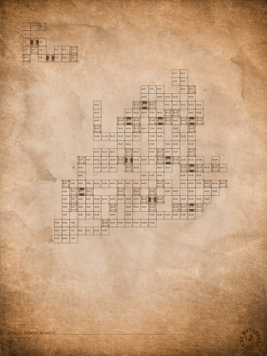

### Playing around with maps - Aug 24, 2025
I didn't really do any extra research but just played around with making the maps a little more interesting. I had an old chart when I had the game which had engineering style maps of the first 3 levels on paper. I tried to create the same effect using some image processing. 

[Here's](images/map1-full.png) a larger version of the image if you want to see the details.

### Rest day  - Aug 24, 2025
This is becoming an obsession and it's entering my dreams. I'm taking a few days off before things become unmanageable. The obsession is what helps me do my best work but it can become too intense. 

Some idle thoughts. The monster sprite sheets only have the monsters facing front, back and left. I presume that's because making them look right is a block flip operation that can done quickly in real time or once when the sheets are loaded so there's considerable space saving.

However, for throwing things and seeing them on the ground at different distances, there are 4 versions of each item at different distances. I imagine it's because scaling things on the fly would require floating point math that would slow down the game considerably. Creating 4 or 5 images at different scales and then compressing the bitmap would be a good compromise saving space as well as computation during run time. This is just my theory but it sounds reasonable and part of the fun of doing this is making such guesses as to why things are as they were. 

### Interpreted maps  - Aug 23, 2025
Was able to read out a map file and make sense of it. [This](https://www.oldgames.sk/dungeon-mapper/map.php?map=20) is the map of the first level. Here is my visualization 

This is not complete since I have not interpreted the doors and such. Just room level. However, the overall plan seems to be accurate. There are also the gaps in the north western corner. I'm not sure what those are but I imagine that they saw a lot of empty space in this file and decided to store some data there just because the space was available. The rest of the level maps take up almost the whole screen.

### Extracted sprite sheets and parsed out Audio files  - Aug 22, 2025
- Found one file (the title screen) is treated specially and doesn't decompress normally. Probably due to space being needed for the menu.
- Was able to extract the sprite sheets using the CMP decoder itself. Here's an example 
- Able to play Adlib sounds from the extracted assets using [Adplay](https://github.com/adplug/adplay-unix)
- Probably going to work with the maps next

### Loading palettes done  - Aug 21, 2025
Added support to load palettes and use them while decoding CMP files. Example decoded file 

### LCW decompression done  - Aug 20, 2025
Remaining LCW commands. Example decoded file 

### LCW decompression - Aug 19, 2025
Implemented basic harness and [Westwood LCW](https://moddingwiki.shikadi.net/wiki/Westwood_LCW) decoder. Commands 1 and 4

### Project Inception - Aug 18, 2025
Initial focus on PAK file parsing and LCW compression algorithms.

Successfully implemented PAK file extraction.

